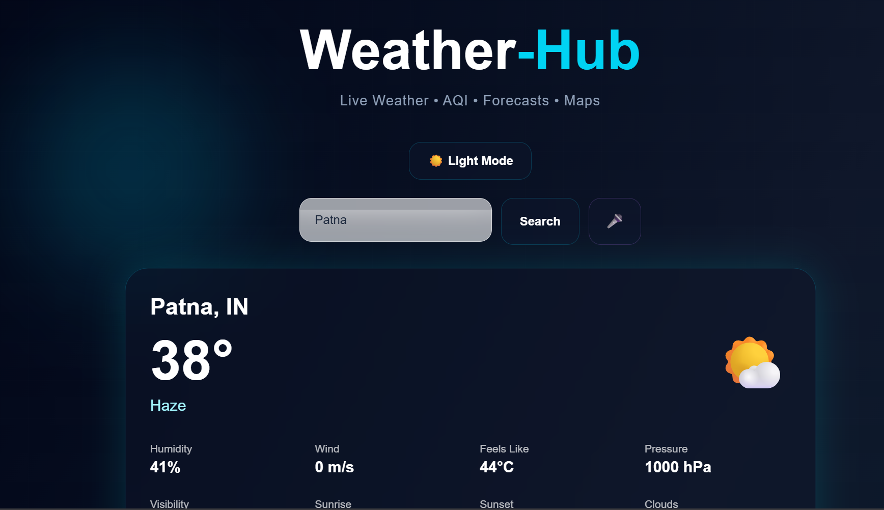

# WeatherSphere 🌦️

A modern weather application built with React, Tailwind CSS, Framer Motion, Leaflet Maps, and OpenWeather API.

## 🚀 Features

* 🌍 Current Location Weather
* 🔍 Smart City Search
* 🎤 Voice Search
* 🌤 Real-Time Weather Data
* 📅 5-Day Forecast
* ⏰ Hourly Forecast
* 🌫 Air Quality Index (AQI)
* ⭐ Favorite Cities
* 🗺 Interactive Weather Map
* 🌙 Dark / Light Mode
* ✨ Smooth Animations
* 📱 Fully Responsive Design

## 🛠 Tech Stack

* React.js
* Tailwind CSS
* Framer Motion
* Axios
* OpenWeather API
* Leaflet Maps
* Vite

## 📦 Installation

```bash
npm install
npm run dev
```

## 📸 Preview



## 🌐 Live Demo

https://weather-hub-phi.vercel.app
## 👨‍💻 Author

**Sumit Yadav**

National Institute of Technology Patna


